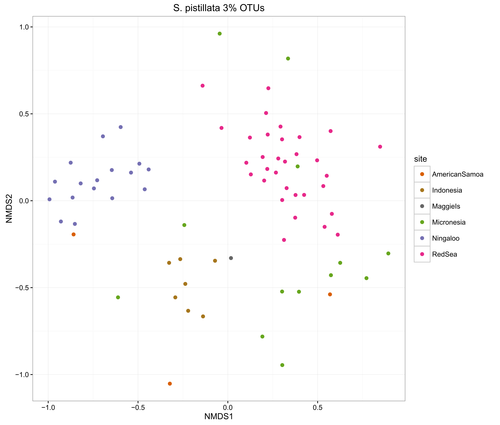
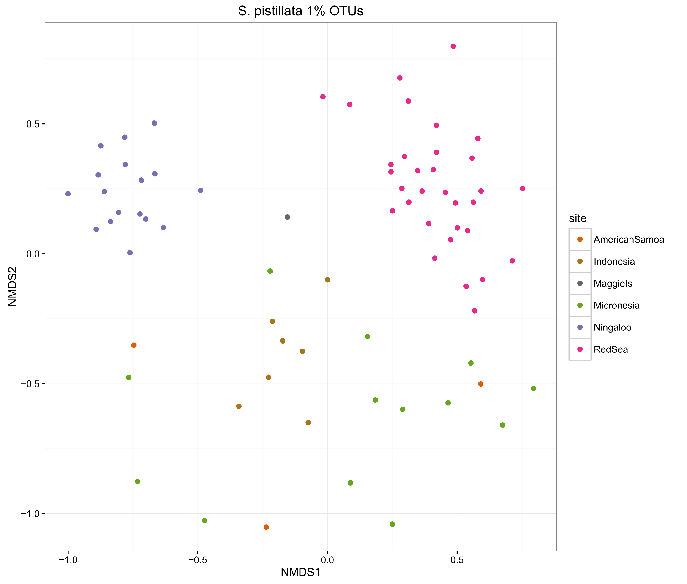
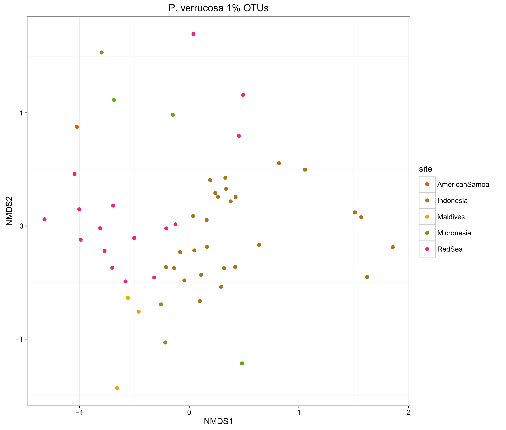
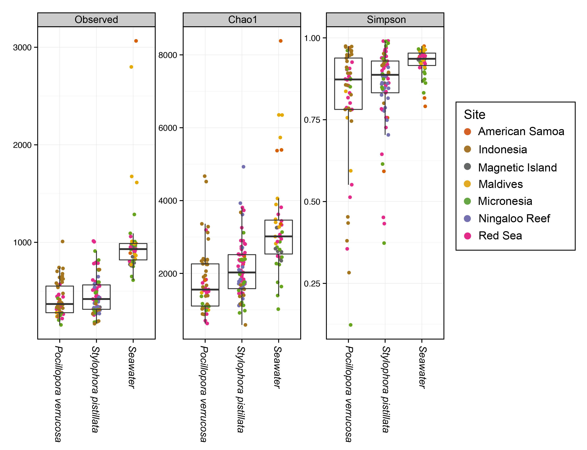
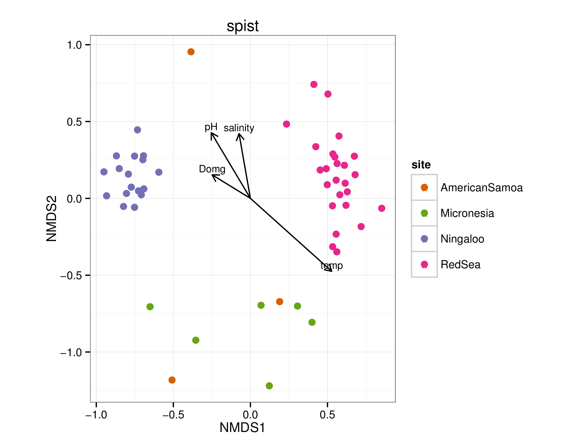
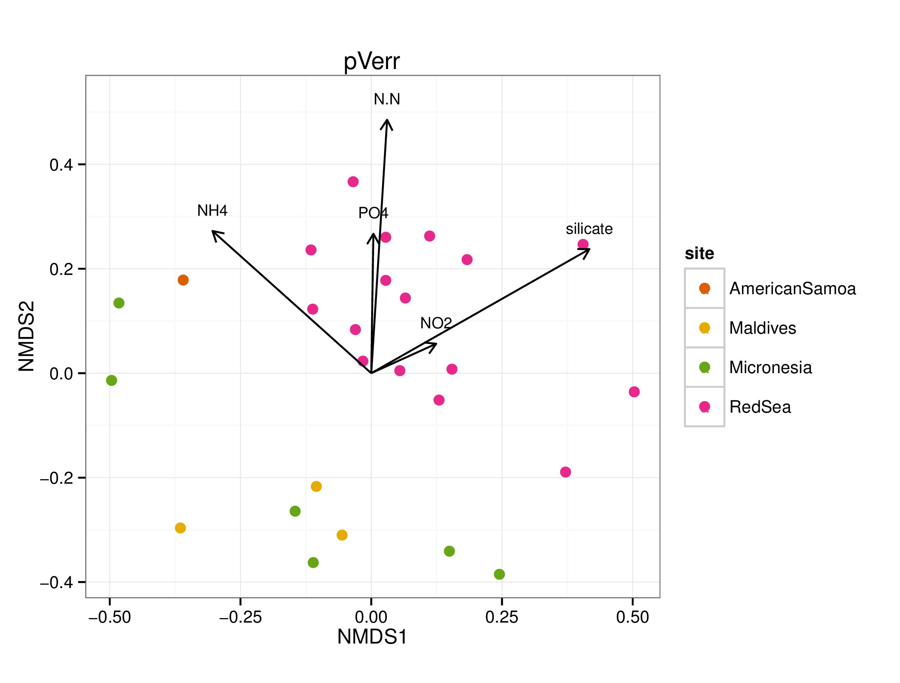
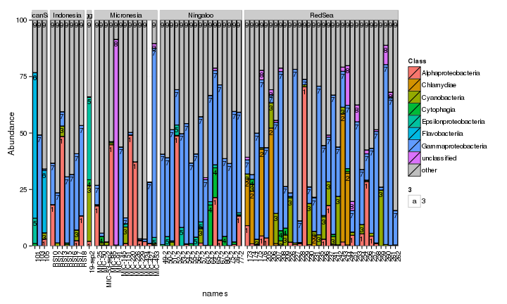

This is an R Markdown document detailing the statistical and graphical steps for reproducing the results in:

Neave, M.J., Rachmawati, R., Xun, L., Michell, C.T., Bourne, D.G., Apprill, A., Voolstra, C.R. (2016). Differential specificity between closely related corals and abundant Endozoicomonas endosymbionts across global scales. The ISME Journal.

### Load required libraries  

```r
library("phyloseq"); packageVersion("phyloseq")
```

```
## [1] '1.10.0'
```

```r
library("ggplot2"); packageVersion("ggplot2")
```

```
## [1] '1.0.1'
```

```r
library("plyr"); packageVersion("plyr")
```

```
## [1] '1.8.1'
```

```r
library("vegan"); packageVersion("vegan")
```

```
## [1] '2.2.1'
```

```r
library("grid"); packageVersion("grid")
```

```
## [1] '3.1.1'
```

```r
library("knitr"); packageVersion("knitr")
```

```
## [1] '1.11'
```

```r
library("clustsig"); packageVersion("clustsig")
```

```
## [1] '1.1'
```

```r
library('ape'); packageVersion("ape")
```

```
## [1] '3.2'
```

```r
library('RColorBrewer'); packageVersion("RColorBrewer")
```

```
## [1] '1.1.2'
```

```r
library("dunn.test"); packageVersion("dunn.test")
```

```
## [1] '1.3.1'
```

```r
library("DESeq2"); packageVersion("DESeq2")
```

```
## [1] '1.6.3'
```

```r
setwd("./data")
opts_knit$set(root.dir = "./data")
#opts_chunk$set(tidy.opts=list(width.cutoff=80))
```

### Import data

First the matrix percent file and count file generated by the minimum entropy decomposition (MED) pipeline, subsampled to 7974 reads per sample, and the accociated taxonony file  


```r
allShared = read.table("all.7974.matrixPercent.txt", header = T, row.names = 1)
allCounts = read.table("all.7974.matrixCount.txt", header = T, row.names = 1)
allTax = read.table("all.7974.nodeReps.nr_v119.knn.taxonomy", header = T, sep = "\t", 
    row.names = 1)
```

```
## Warning in scan(file, what, nmax, sep, dec, quote, skip, nlines,
## na.strings, : number of items read is not a multiple of the number of
## columns
```

```r
allTax = allTax[, 2:8]
allTax = as.matrix(allTax)
```

Import the shared and taxonomy files generated in mothur for 3% and 1% pairwise similarity, in order to calculate alpha diversity measures and to compare to the MED procedure. Also import the 3% OTU file without any subsampling for alpha diversity calculations.   


```r
all3OTUshared = read.table("all.7974.0.03.pick.shared", header=T, row.names=2)
all3OTUshared = all3OTUshared[,3:length(all3OTUshared)]

alpha3OTUshared = read.table("all.7974.0.03.shared", header=T)
rownames(alpha3OTUshared) = alpha3OTUshared[,2]
alpha3OTUshared = alpha3OTUshared[,4:length(alpha3OTUshared)]

all1OTUshared = read.table("all.7974.0.01.pick.shared", header=T, row.names=2)
all1OTUshared = all1OTUshared[,3:length(all1OTUshared)]

all3OTUtax = read.table('all.7974.0.03.taxonomy', header=T, sep='\t', row.names=1)
all3OTUtax = all3OTUtax[,2:8]
all3OTUtax = as.matrix(all3OTUtax)

all1OTUtax = read.table('all.7974.0.01.taxonomy', header=T, sep='\t', row.names=1)
all1OTUtax = all1OTUtax[,2:8]
all1OTUtax = as.matrix(all1OTUtax)
```

Import Endozoicomonas phylogenetic tree (exported from ARB) using the APE package (Fig. 3). Also import a MED percent matrix that is slightly modified to accomodate the tree  


```r
endoTreeFile = read.tree(file='MEDNJ5.tree')
allSharedTree = read.table("all.7974.matrixPercent.tree.txt", header=T, row.names=1)
```


Import meta data for the samples, including metaData3.txt, which is slightly modified to accomodate heatmap sample ordering, and metaDataChem which contains additional columns of physiochemical data  


```r
metaFile = read.table('metaData2.MED', header=T, sep='\t', row.names=1)
metaFile3 = read.table('metaData3.txt', header=T, sep='\t', row.names=1)
metaFileChem = read.table('metaDataChem.txt', header=T, sep='\t', row.names=1)
```

### Create phyloseq objects and add consistent coloring for sites


```r
OTU = otu_table(allShared, taxa_are_rows = FALSE)
OTUcounts = otu_table(allCounts, taxa_are_rows = FALSE)
OTUs3 = otu_table(all3OTUshared, taxa_are_rows = FALSE)
OTUs3alpha = otu_table(alpha3OTUshared, taxa_are_rows = FALSE)
OTUs1 = otu_table(all1OTUshared, taxa_are_rows = FALSE)
OTUtree = otu_table(allSharedTree, taxa_are_rows = FALSE)

TAX = tax_table(allTax)
TAX3 = tax_table(all3OTUtax)
TAX1 = tax_table(all1OTUtax)

META = sample_data(metaFile)
METAchem = sample_data(metaFileChem)
TREE = phy_tree(endoTreeFile)

allPhylo = phyloseq(OTU, TAX, META)
countPhylo = phyloseq(OTUcounts, TAX, META)
all3OTUphylo = phyloseq(OTUs3, TAX3, META)
alpha3OTUphylo = phyloseq(OTUs3alpha, META)
all1OTUphylo = phyloseq(OTUs1, TAX1, META)
allPhyloChem = phyloseq(OTU, TAX, METAchem)
endoTree = phyloseq(OTUtree, META, TREE)

cols <- c(AmericanSamoa = "#D95F02", Indonesia = "#A6761D", MaggieIs = "#666666", 
    Maldives = "#E6AB02", Micronesia = "#66A61E", Ningaloo = "#7570B3", RedSea = "#E7298A", 
    other = "black")
```

### Ordinations to compare MED vs pairwise OTUs 

Subset samples for the two corals, remove taxa with 0s, create relative abundance and square-root sample counts


```r
filter_stylo_data <- function(initial_matrix){
  initial_coral <- subset_samples(initial_matrix, species=="Stylophora pistillata")
  coral_filt = filter_taxa(initial_coral, function(x) mean(x) > 0, TRUE)
  coral_filt_rel = transform_sample_counts(coral_filt, function(x) x / sum(x) )
  coral_filt_rel_sqrt = transform_sample_counts(coral_filt_rel, function(x) sqrt(x) ) 
  return(coral_filt_rel_sqrt)
}

filter_pverr_data <- function(initial_matrix){
  initial_coral <- subset_samples(initial_matrix, species=="Pocillopora verrucosa")
  coral_filt = filter_taxa(initial_coral, function(x) mean(x) > 0, TRUE)
  coral_filt_rel = transform_sample_counts(coral_filt, function(x) x / sum(x) )
  coral_filt_rel_sqrt = transform_sample_counts(coral_filt_rel, function(x) sqrt(x) ) 
  return(coral_filt_rel_sqrt)
}

spistPhyloRelSqrt <- filter_stylo_data(allPhylo)
spist3OTUphyloRelSqrt <- filter_stylo_data(all3OTUphylo)
spist1OTUphyloRelSqrt <- filter_stylo_data(all1OTUphylo)

pverrPhyloRelSqrt <- filter_pverr_data(allPhylo)
pverr3OTUphyloRelSqrt <- filter_pverr_data(all3OTUphylo)
pverr1OTUphyloRelSqrt <- filter_pverr_data(all1OTUphylo)
```

Now do ordinations for each 


```r
compOrdinations <- function(sample_data, sample_name) {
    theme_set(theme_bw())
    sample_dataOrd <- ordinate(sample_data, "NMDS", "bray")
    plot_ordination(sample_data, sample_dataOrd, type = "samples", color = "site", 
        title = sample_name) + geom_point(size = 2) + scale_color_manual(values = cols)
}

compOrdinations(spistPhyloRelSqrt, "S. pistillata MED OTUs")
```

```
## Run 0 stress 0.2253556 
## Run 1 stress 0.234422 
## Run 2 stress 0.239875 
## Run 3 stress 0.2388818 
## Run 4 stress 0.234468 
## Run 5 stress 0.2532859 
## Run 6 stress 0.2310713 
## Run 7 stress 0.2272757 
## Run 8 stress 0.2380208 
## Run 9 stress 0.2323858 
## Run 10 stress 0.2375546 
## Run 11 stress 0.2413332 
## Run 12 stress 0.2406818 
## Run 13 stress 0.2330045 
## Run 14 stress 0.2415347 
## Run 15 stress 0.2360013 
## Run 16 stress 0.2350567 
## Run 17 stress 0.252324 
## Run 18 stress 0.2322089 
## Run 19 stress 0.2319302 
## Run 20 stress 0.2243104 
## ... New best solution
## ... procrustes: rmse 0.08223169  max resid 0.3308432
```

 

```r
compOrdinations(spist3OTUphyloRelSqrt, "S. pistillata 3% OTUs")
```

```
## Run 0 stress 0.2272753 
## Run 1 stress 0.2286452 
## Run 2 stress 0.2316415 
## Run 3 stress 0.2403034 
## Run 4 stress 0.2422737 
## Run 5 stress 0.2266968 
## ... New best solution
## ... procrustes: rmse 0.01352437  max resid 0.09839116 
## Run 6 stress 0.2267772 
## ... procrustes: rmse 0.003399554  max resid 0.02201426 
## Run 7 stress 0.2466988 
## Run 8 stress 0.2334093 
## Run 9 stress 0.2378561 
## Run 10 stress 0.2499629 
## Run 11 stress 0.2534342 
## Run 12 stress 0.2411402 
## Run 13 stress 0.2461736 
## Run 14 stress 0.2424098 
## Run 15 stress 0.2541418 
## Run 16 stress 0.2462089 
## Run 17 stress 0.2534672 
## Run 18 stress 0.2592781 
## Run 19 stress 0.2377688 
## Run 20 stress 0.2486001
```

 

```r
compOrdinations(spist1OTUphyloRelSqrt, "S. pistillata 1% OTUs")
```

```
## Run 0 stress 0.2225417 
## Run 1 stress 0.2265881 
## Run 2 stress 0.258715 
## Run 3 stress 0.2602584 
## Run 4 stress 0.255139 
## Run 5 stress 0.2456678 
## Run 6 stress 0.2436214 
## Run 7 stress 0.2325285 
## Run 8 stress 0.2412761 
## Run 9 stress 0.2304457 
## Run 10 stress 0.2332069 
## Run 11 stress 0.2349299 
## Run 12 stress 0.2600278 
## Run 13 stress 0.2536479 
## Run 14 stress 0.250939 
## Run 15 stress 0.2273785 
## Run 16 stress 0.228827 
## Run 17 stress 0.2446146 
## Run 18 stress 0.2602162 
## Run 19 stress 0.2544731 
## Run 20 stress 0.2225414 
## ... New best solution
## ... procrustes: rmse 0.0001117761  max resid 0.0006041839 
## *** Solution reached
```

 

```r
compOrdinations(pverrPhyloRelSqrt, "P. verrucosa MED OTUs")
```

```
## Run 0 stress 0.2436511 
## Run 1 stress 0.2205186 
## ... New best solution
## ... procrustes: rmse 0.09207889  max resid 0.289982 
## Run 2 stress 0.26454 
## Run 3 stress 0.2378086 
## Run 4 stress 0.2414353 
## Run 5 stress 0.2346433 
## Run 6 stress 0.2499604 
## Run 7 stress 0.2370147 
## Run 8 stress 0.2293502 
## Run 9 stress 0.2561392 
## Run 10 stress 0.2410759 
## Run 11 stress 0.2247996 
## Run 12 stress 0.2399461 
## Run 13 stress 0.2337063 
## Run 14 stress 0.237615 
## Run 15 stress 0.2153855 
## ... New best solution
## ... procrustes: rmse 0.06094373  max resid 0.3421333 
## Run 16 stress 0.2250045 
## Run 17 stress 0.2280468 
## Run 18 stress 0.2234524 
## Run 19 stress 0.2482888 
## Run 20 stress 0.223437
```

 

```r
compOrdinations(pverr3OTUphyloRelSqrt, "P. verrucosa 3% OTUs")
```

```
## Run 0 stress 0.2409034 
## Run 1 stress 0.2379379 
## ... New best solution
## ... procrustes: rmse 0.07397534  max resid 0.274985 
## Run 2 stress 0.2473025 
## Run 3 stress 0.2369663 
## ... New best solution
## ... procrustes: rmse 0.04480912  max resid 0.2091055 
## Run 4 stress 0.2422282 
## Run 5 stress 0.251737 
## Run 6 stress 0.2468995 
## Run 7 stress 0.2357334 
## ... New best solution
## ... procrustes: rmse 0.0870699  max resid 0.2548444 
## Run 8 stress 0.2251723 
## ... New best solution
## ... procrustes: rmse 0.05015674  max resid 0.3506562 
## Run 9 stress 0.2237318 
## ... New best solution
## ... procrustes: rmse 0.05189387  max resid 0.3327933 
## Run 10 stress 0.2237788 
## ... procrustes: rmse 0.04792119  max resid 0.3349704 
## Run 11 stress 0.229127 
## Run 12 stress 0.2384322 
## Run 13 stress 0.234641 
## Run 14 stress 0.2417115 
## Run 15 stress 0.2509402 
## Run 16 stress 0.2235731 
## ... New best solution
## ... procrustes: rmse 0.05175333  max resid 0.3316109 
## Run 17 stress 0.2238043 
## ... procrustes: rmse 0.007118133  max resid 0.03723605 
## Run 18 stress 0.2283226 
## Run 19 stress 0.2237814 
## ... procrustes: rmse 0.02155805  max resid 0.1361891 
## Run 20 stress 0.2518367
```

 

```r
compOrdinations(pverr1OTUphyloRelSqrt, "P. verrucosa 1% OTUs")
```

```
## Run 0 stress 0.2340332 
## Run 1 stress 0.2430948 
## Run 2 stress 0.219327 
## ... New best solution
## ... procrustes: rmse 0.107841  max resid 0.3581913 
## Run 3 stress 0.2302221 
## Run 4 stress 0.2186754 
## ... New best solution
## ... procrustes: rmse 0.0680086  max resid 0.3282367 
## Run 5 stress 0.2388485 
## Run 6 stress 0.2265964 
## Run 7 stress 0.2279413 
## Run 8 stress 0.2205944 
## Run 9 stress 0.2324111 
## Run 10 stress 0.2277589 
## Run 11 stress 0.2199854 
## Run 12 stress 0.2410125 
## Run 13 stress 0.2302097 
## Run 14 stress 0.2364181 
## Run 15 stress 0.224181 
## Run 16 stress 0.2268835 
## Run 17 stress 0.2326262 
## Run 18 stress 0.2388328 
## Run 19 stress 0.2349037 
## Run 20 stress 0.2281152
```

 

### Alpha diversity measures

First subset the corals, then plot using phyloseq and ggplot2

Note: I'll use unsubampled 3% pairwise OTUs for calculation of alpha diversity measures as this will make them more comparable to other studies, plus the MED pipeline is has not yet implemented alpha diversity


```r
allAlphaTmp <- subset_samples(alpha3OTUphylo, species == "seawater")
allAlphaTmp2 <- subset_samples(alpha3OTUphylo, species == "Stylophora pistillata")
allAlphaTmp3 <- subset_samples(alpha3OTUphylo, species == "Pocillopora verrucosa")
allAlpha2 <- merge_phyloseq(allAlphaTmp, allAlphaTmp2, allAlphaTmp3)

allAlphaPlot2 <- plot_richness(allAlpha2, x = "species", measures = c("Chao1", "Simpson", 
    "observed"), color = "site", sortby = "Chao1")

ggplot(data = allAlphaPlot2$data) + geom_point(aes(x = species, y = value, color = site), 
    position = position_jitter(width = 0.1, height = 0)) + geom_boxplot(aes(x = species, 
    y = value, color = NULL), alpha = 0.1, outlier.shape = NA) + scale_color_manual(values = cols) + 
    theme(axis.text.x = element_text(angle = 90)) + facet_wrap(~variable, scales = "free_y") + 
    scale_x_discrete(limits = c("Stylophora pistillata", "Pocillopora verrucosa", 
        "seawater"))
```

```
## Warning: Removed 3 rows containing missing values (geom_point).
```

```
## Warning: Removed 7 rows containing missing values (geom_point).
```

```
## Warning: Removed 4 rows containing missing values (geom_point).
```

```
## Warning: Removed 6 rows containing missing values (geom_point).
```

```
## Warning: Removed 4 rows containing missing values (geom_point).
```

```
## Warning: Removed 7 rows containing missing values (geom_point).
```

```
## Warning: Removed 4 rows containing missing values (geom_point).
```

```
## Warning: Removed 4 rows containing missing values (geom_point).
```

 

Check for significant differences in the alpha diversity measures using a kruskal-wallis test and a dunn post-hoc test to check which specific groups were different


```r
alphaObserved = estimate_richness(allAlpha2, measures="Observed")
alphaSimpson = estimate_richness(allAlpha2, measures="Simpson")
alphaChao = estimate_richness(allAlpha2, measures="Chao1")

alpha.stats <- cbind(alphaObserved, sample_data(allAlpha2))
alpha.stats2 <- cbind(alpha.stats, alphaSimpson)
alpha.stats3 <- cbind(alpha.stats2, alphaChao)

kruskal.test(Observed~species, data = alpha.stats3)
```

```
## 
## 	Kruskal-Wallis rank sum test
## 
## data:  Observed by species
## Kruskal-Wallis chi-squared = 61.8764, df = 2, p-value = 3.662e-14
```

```r
dunn.test(alpha.stats3$Observed, alpha.stats3$species, method="bonferroni")
```

```
##   Kruskal-Wallis rank sum test
## 
## data: x and group
## Kruskal-Wallis chi-squared = 61.8764, df = 2, p-value = 0
## 
## 
##                            Comparison of x by group                            
##                                  (Bonferroni)                                  
## Col Mean-|
## Row Mean |   Pocillop   seawater
## ---------+----------------------
## seawater |  -7.510384
##          |     0.0000
##          |
## Stylopho |  -1.357184   6.783011
##          |     0.2621     0.0000
```

```r
kruskal.test(Simpson~species, data = alpha.stats3)
```

```
## 
## 	Kruskal-Wallis rank sum test
## 
## data:  Simpson by species
## Kruskal-Wallis chi-squared = 12.2453, df = 2, p-value = 0.002193
```

```r
dunn.test(alpha.stats3$Simpson, alpha.stats3$species, method="bonferroni")
```

```
##   Kruskal-Wallis rank sum test
## 
## data: x and group
## Kruskal-Wallis chi-squared = 12.2453, df = 2, p-value = 0
## 
## 
##                            Comparison of x by group                            
##                                  (Bonferroni)                                  
## Col Mean-|
## Row Mean |   Pocillop   seawater
## ---------+----------------------
## seawater |  -3.397898
##          |     0.0010
##          |
## Stylopho |  -0.811204   2.904738
##          |     0.6259     0.0055
```

```r
kruskal.test(Chao1~species, data = alpha.stats3)
```

```
## 
## 	Kruskal-Wallis rank sum test
## 
## data:  Chao1 by species
## Kruskal-Wallis chi-squared = 64.3067, df = 2, p-value = 1.086e-14
```

```r
dunn.test(alpha.stats3$Chao1, alpha.stats3$species, method="bonferroni")
```

```
##   Kruskal-Wallis rank sum test
## 
## data: x and group
## Kruskal-Wallis chi-squared = 64.3067, df = 2, p-value = 0
## 
## 
##                            Comparison of x by group                            
##                                  (Bonferroni)                                  
## Col Mean-|
## Row Mean |   Pocillop   seawater
## ---------+----------------------
## seawater |  -7.581725
##          |     0.0000
##          |
## Stylopho |  -1.146749   7.033279
##          |     0.3772     0.0000
```

In each case, the seawater was signficiantly different to the corals, while the corals were not different to each other. This suggests the corals have a more 'selective' community of microbes compared to the surrounding seawater. 

### Similarity Profile Analysis (SIMPROF)

This will show how the samples cluster without any a priori assumptions regarding sample origin

Need to import the shared file containing just spist OTUs, then calcualte the simprof clusters based on the braycurtis metric. 


```r
spist <- subset_samples(allPhylo, species == "Stylophora pistillata")
spistShared = otu_table(spist)
class(spistShared) <- "numeric"
```

```
## Warning in class(spistShared) <- "numeric": Setting class(x) to "numeric"
## sets attribute to NULL; result will no longer be an S4 object
```

```r
spistSIMPROF <- simprof(spistShared, num.expected = 1000, num.simulated = 99, method.cluster = "average", 
    method.distance = "braycurtis", method.transform = "squareroot", alpha = 0.05, 
    sample.orientation = "row", silent = TRUE)
```

```
## Warning: This version of the Bray-Curtis index does not use
## standardization.
```

```
## Warning: To use the standardized version, use "actual-braycurtis".
```

```
## Warning: See the help documentation for more information.
```

```r
simprof.plot(spistSIMPROF, leafcolors = NA, plot = TRUE, fill = TRUE, leaflab = "perpendicular", 
    siglinetype = 1)
```

 

```
## 'dendrogram' with 2 branches and 73 members total, at height 99.58749
```

```r
pVerr <- subset_samples(allPhylo, species == "Pocillopora verrucosa")
pVerrShared = otu_table(pVerr)
class(pVerrShared) <- "numeric"
```

```
## Warning in class(pVerrShared) <- "numeric": Setting class(x) to "numeric"
## sets attribute to NULL; result will no longer be an S4 object
```

```r
pVerrSIMPROF <- simprof(pVerrShared, num.expected = 1000, num.simulated = 99, method.cluster = "average", 
    method.distance = "braycurtis", method.transform = "squareroot", alpha = 0.05, 
    sample.orientation = "row", silent = TRUE)
```

```
## Warning: This version of the Bray-Curtis index does not use
## standardization.
```

```
## Warning: To use the standardized version, use "actual-braycurtis".
```

```
## Warning: See the help documentation for more information.
```

```r
simprof.plot(pVerrSIMPROF, leafcolors = NA, plot = TRUE, fill = TRUE, leaflab = "perpendicular", 
    siglinetype = 1)
```

 

```
## 'dendrogram' with 2 branches and 53 members total, at height 99.459
```

### Chemical and biological correlations

Use the envfit function from the Vegan package to test if any environmental variables are significantly correlated with microbiome differences in the corals


```r
draw_envfit_ord <- function(coral_chem, env_data) {
    chemNoNA <- na.omit(metaFileChem[sample_names(coral_chem), env_data])
    coralNoNA <- prune_samples(rownames(chemNoNA), coral_chem)
    
    theme_set(theme_bw())
    coralNoNAOrd <- ordinate(coralNoNA, "NMDS", "bray")
    coralNoNAOrdPlot <- plot_ordination(coralNoNA, coralNoNAOrd, type = "samples", 
        color = "site") + geom_point(size = 3) + scale_color_manual(values = c(cols))
    
    # get points for ggplot
    pointsNoNA <- coralNoNAOrd$points[rownames(chemNoNA), ]
    chemFit <- envfit(pointsNoNA, env = chemNoNA, na.rm = TRUE)
    print(chemFit)
    chemFit.scores <- as.data.frame(scores(chemFit, display = "vectors"))
    chemFit.scores <- cbind(chemFit.scores, Species = rownames(chemFit.scores))
    
    # create arrow info
    chemNames <- rownames(chemFit.scores)
    arrowmap <- aes(xend = MDS1, yend = MDS2, x = 0, y = 0, shape = NULL, color = NULL)
    labelmap <- aes(x = MDS1, y = MDS2 + 0.04, shape = NULL, color = NULL, size = 1.5, 
        label = chemNames)
    arrowhead = arrow(length = unit(0.25, "cm"))
    
    # note: had to use aes_string to get ggplot to recognize variables
    coralNoNAOrdPlot + coord_fixed() + geom_segment(arrowmap, size = 0.5, data = chemFit.scores, 
        color = "black", arrow = arrowhead, show_guide = FALSE) + geom_text(aes_string(x = "MDS1", 
        y = "MDS2", shape = NULL, color = NULL, size = 1.5, label = "Species"), size = 3, 
        data = chemFit.scores)
}

waterQual <- c("temp", "salinity", "Domg", "pH")
nutrients <- c("PO4", "N.N", "silicate", "NO2", "NH4")
FCM <- c("prok", "syn", "peuk", "pe.peuk", "Hbact")

spistChem <- subset_samples(allPhyloChem, species == "Stylophora pistillata")
pverrChem <- subset_samples(allPhyloChem, species == "Pocillopora verrucosa")

draw_envfit_ord(spistChem, waterQual)
```

```
## Square root transformation
## Wisconsin double standardization
## Run 0 stress 0.1890492 
## Run 1 stress 0.2268404 
## Run 2 stress 0.1925559 
## Run 3 stress 0.1873651 
## ... New best solution
## ... procrustes: rmse 0.08727293  max resid 0.389137 
## Run 4 stress 0.2167557 
## Run 5 stress 0.1841876 
## ... New best solution
## ... procrustes: rmse 0.07420158  max resid 0.3993087 
## Run 6 stress 0.1857981 
## Run 7 stress 0.2105627 
## Run 8 stress 0.1864097 
## Run 9 stress 0.2086 
## Run 10 stress 0.1871904 
## Run 11 stress 0.1940688 
## Run 12 stress 0.2144034 
## Run 13 stress 0.1788937 
## ... New best solution
## ... procrustes: rmse 0.04158202  max resid 0.2820051 
## Run 14 stress 0.1934386 
## Run 15 stress 0.1729033 
## ... New best solution
## ... procrustes: rmse 0.04036827  max resid 0.2729433 
## Run 16 stress 0.1954008 
## Run 17 stress 0.2143151 
## Run 18 stress 0.2038303 
## Run 19 stress 0.2129236 
## Run 20 stress 0.2185808 
## 
## ***VECTORS
## 
##              MDS1     MDS2     r2 Pr(>r)    
## temp      0.75871 -0.65143 0.4813  0.001 ***
## salinity -0.15146  0.98846 0.1597  0.009 ** 
## Domg     -0.91133  0.41168 0.0833  0.121    
## pH       -0.53245  0.84646 0.2194  0.006 ** 
## ---
## Signif. codes:  0 '***' 0.001 '**' 0.01 '*' 0.05 '.' 0.1 ' ' 1
## Permutation: free
## Number of permutations: 999
```

 

```r
draw_envfit_ord(spistChem, nutrients)
```

```
## Square root transformation
## Wisconsin double standardization
## Run 0 stress 0.1927469 
## Run 1 stress 0.2070681 
## Run 2 stress 0.1905582 
## ... New best solution
## ... procrustes: rmse 0.08666147  max resid 0.3906633 
## Run 3 stress 0.1837237 
## ... New best solution
## ... procrustes: rmse 0.0818693  max resid 0.3969611 
## Run 4 stress 0.2117091 
## Run 5 stress 0.1997919 
## Run 6 stress 0.2177915 
## Run 7 stress 0.2145906 
## Run 8 stress 0.2146711 
## Run 9 stress 0.203531 
## Run 10 stress 0.1963953 
## Run 11 stress 0.2026872 
## Run 12 stress 0.2069791 
## Run 13 stress 0.1774209 
## ... New best solution
## ... procrustes: rmse 0.04163872  max resid 0.2726075 
## Run 14 stress 0.1837241 
## Run 15 stress 0.2090352 
## Run 16 stress 0.2072807 
## Run 17 stress 0.2052012 
## Run 18 stress 0.2094738 
## Run 19 stress 0.1952729 
## Run 20 stress 0.1837222 
## 
## ***VECTORS
## 
##              MDS1     MDS2     r2 Pr(>r)    
## PO4      -0.24248  0.97016 0.2268  0.004 ** 
## N.N       0.85590 -0.51714 0.0672  0.179    
## silicate -0.80233  0.59688 0.4800  0.001 ***
## NO2      -0.53794  0.84298 0.4273  0.001 ***
## NH4       0.78539 -0.61900 0.0203  0.612    
## ---
## Signif. codes:  0 '***' 0.001 '**' 0.01 '*' 0.05 '.' 0.1 ' ' 1
## Permutation: free
## Number of permutations: 999
```

 

```r
draw_envfit_ord(spistChem, FCM)
```

```
## Square root transformation
## Wisconsin double standardization
## Run 0 stress 0.1927469 
## Run 1 stress 0.2162146 
## Run 2 stress 0.4028602 
## Run 3 stress 0.1847537 
## ... New best solution
## ... procrustes: rmse 0.03051245  max resid 0.1973362 
## Run 4 stress 0.2168534 
## Run 5 stress 0.2108602 
## Run 6 stress 0.2171044 
## Run 7 stress 0.2126912 
## Run 8 stress 0.1962924 
## Run 9 stress 0.1963493 
## Run 10 stress 0.1837222 
## ... New best solution
## ... procrustes: rmse 0.01019948  max resid 0.06494447 
## Run 11 stress 0.2198189 
## Run 12 stress 0.1774208 
## ... New best solution
## ... procrustes: rmse 0.04147211  max resid 0.2726479 
## Run 13 stress 0.1942648 
## Run 14 stress 0.1817669 
## Run 15 stress 0.2063692 
## Run 16 stress 0.1970896 
## Run 17 stress 0.1937709 
## Run 18 stress 0.197381 
## Run 19 stress 0.1973012 
## Run 20 stress 0.2107897 
## 
## ***VECTORS
## 
##             MDS1     MDS2     r2 Pr(>r)    
## prok    -0.05013 -0.99874 0.2678  0.001 ***
## syn      0.54913  0.83574 0.1100  0.037 *  
## peuk     0.53372  0.84566 0.0852  0.082 .  
## pe.peuk  0.95500  0.29660 0.0543  0.226    
## Hbact   -0.76909  0.63914 0.0420  0.370    
## ---
## Signif. codes:  0 '***' 0.001 '**' 0.01 '*' 0.05 '.' 0.1 ' ' 1
## Permutation: free
## Number of permutations: 999
```

 

```r
draw_envfit_ord(pverrChem, waterQual)
```

```
## Square root transformation
## Wisconsin double standardization
## Run 0 stress 0.2598627 
## Run 1 stress 0.2634075 
## Run 2 stress 0.2543954 
## ... New best solution
## ... procrustes: rmse 0.1501171  max resid 0.3488079 
## Run 3 stress 0.262027 
## Run 4 stress 0.2509821 
## ... New best solution
## ... procrustes: rmse 0.1390603  max resid 0.4750958 
## Run 5 stress 0.2538915 
## Run 6 stress 0.2667932 
## Run 7 stress 0.257202 
## Run 8 stress 0.2558393 
## Run 9 stress 0.2511791 
## ... procrustes: rmse 0.161753  max resid 0.4343423 
## Run 10 stress 0.2800109 
## Run 11 stress 0.2558289 
## Run 12 stress 0.2579589 
## Run 13 stress 0.2529655 
## Run 14 stress 0.2761134 
## Run 15 stress 0.2554928 
## Run 16 stress 0.2568314 
## Run 17 stress 0.2633169 
## Run 18 stress 0.2565251 
## Run 19 stress 0.2553608 
## Run 20 stress 0.265858
```

```
## Warning in postMDS(out$points, dis, plot = max(0, plot - 1), ...): skipping
## half-change scaling: too few points below threshold
```

```
## 
## ***VECTORS
## 
##              MDS1     MDS2     r2 Pr(>r)   
## temp      0.23382  0.97228 0.4251  0.006 **
## salinity  0.15289 -0.98824 0.3311  0.020 * 
## Domg     -0.99489  0.10092 0.0597  0.523   
## pH       -0.01848 -0.99983 0.3003  0.021 * 
## ---
## Signif. codes:  0 '***' 0.001 '**' 0.01 '*' 0.05 '.' 0.1 ' ' 1
## Permutation: free
## Number of permutations: 999
```

 

```r
draw_envfit_ord(pverrChem, nutrients)
```

```
## Square root transformation
## Wisconsin double standardization
## Run 0 stress 0.2619697 
## Run 1 stress 0.2656607 
## Run 2 stress 0.2806436 
## Run 3 stress 0.2642239 
## Run 4 stress 0.2585026 
## ... New best solution
## ... procrustes: rmse 0.1456247  max resid 0.4514051 
## Run 5 stress 0.2652625 
## Run 6 stress 0.2555115 
## ... New best solution
## ... procrustes: rmse 0.1688281  max resid 0.3936874 
## Run 7 stress 0.2603838 
## Run 8 stress 0.2625684 
## Run 9 stress 0.2667406 
## Run 10 stress 0.2749052 
## Run 11 stress 0.2810672 
## Run 12 stress 0.2434124 
## ... New best solution
## ... procrustes: rmse 0.08711831  max resid 0.344812 
## Run 13 stress 0.257938 
## Run 14 stress 0.2654218 
## Run 15 stress 0.2645719 
## Run 16 stress 0.2607204 
## Run 17 stress 0.2623654 
## Run 18 stress 0.2721545 
## Run 19 stress 0.2591679 
## Run 20 stress 0.2605074
```

```
## Warning in postMDS(out$points, dis, plot = max(0, plot - 1), ...): skipping
## half-change scaling: too few points below threshold
```

```
## 
## ***VECTORS
## 
##              MDS1     MDS2     r2 Pr(>r)  
## PO4       0.04248  0.99910 0.0808  0.375  
## N.N       0.06363  0.99797 0.2207  0.056 .
## silicate  0.83138  0.55571 0.2191  0.063 .
## NO2       0.27636  0.96105 0.0109  0.888  
## NH4      -0.75677  0.65369 0.1645  0.120  
## ---
## Signif. codes:  0 '***' 0.001 '**' 0.01 '*' 0.05 '.' 0.1 ' ' 1
## Permutation: free
## Number of permutations: 999
```

 

```r
draw_envfit_ord(pverrChem, FCM)
```

```
## Square root transformation
## Wisconsin double standardization
## Run 0 stress 0.2619697 
## Run 1 stress 0.2811992 
## Run 2 stress 0.2609176 
## ... New best solution
## ... procrustes: rmse 0.1199599  max resid 0.330047 
## Run 3 stress 0.2648193 
## Run 4 stress 0.2522078 
## ... New best solution
## ... procrustes: rmse 0.1634341  max resid 0.3844411 
## Run 5 stress 0.2563836 
## Run 6 stress 0.2585329 
## Run 7 stress 0.2539762 
## Run 8 stress 0.2794801 
## Run 9 stress 0.2703295 
## Run 10 stress 0.2702247 
## Run 11 stress 0.260212 
## Run 12 stress 0.2434229 
## ... New best solution
## ... procrustes: rmse 0.1100799  max resid 0.2957997 
## Run 13 stress 0.2631811 
## Run 14 stress 0.2748838 
## Run 15 stress 0.2432568 
## ... New best solution
## ... procrustes: rmse 0.01184005  max resid 0.03370115 
## Run 16 stress 0.2629161 
## Run 17 stress 0.2560271 
## Run 18 stress 0.2437147 
## ... procrustes: rmse 0.05145394  max resid 0.1807875 
## Run 19 stress 0.2536212 
## Run 20 stress 0.243433 
## ... procrustes: rmse 0.03141653  max resid 0.1071445
```

```
## Warning in postMDS(out$points, dis, plot = max(0, plot - 1), ...): skipping
## half-change scaling: too few points below threshold
```

```
## 
## ***VECTORS
## 
##             MDS1     MDS2     r2 Pr(>r)    
## prok    -0.28887 -0.95737 0.4431  0.001 ***
## syn     -0.62071 -0.78404 0.0366  0.675    
## peuk     0.60373 -0.79719 0.0241  0.755    
## pe.peuk -0.66198  0.74952 0.0365  0.639    
## Hbact   -0.22203 -0.97504 0.0908  0.348    
## ---
## Signif. codes:  0 '***' 0.001 '**' 0.01 '*' 0.05 '.' 0.1 ' ' 1
## Permutation: free
## Number of permutations: 999
```

 

### Taxonomic barcharts of bacteria in the corals and seawaters, and core microbiome members


```r
# define a function to draw barcharts at a specific taxonomic level
# also need to create my own ggplot colors then replace the last one ('other' column) with gray

gg_color_hue <- function(n) {
  hues = seq(15, 375, length=n+1)
  hcl(h=hues, l=65, c=100)[1:n]
}

draw_barcharts <- function(coral_species, tax_level) {

coralFiltGlom <- tax_glom(coral_species, taxrank=tax_level)
physeqdf <- psmelt(coralFiltGlom)

# get total abundance so can make an 'other' column
# had to add ^ and $ characters to make sure grep matches whole word

physeqdfOther <- physeqdf

for (j in unique(physeqdf$Sample)) {
  jFirst = paste('^', j, sep='')
  jBoth = paste(jFirst, '$', sep='')
  rowNumbers = grep(jBoth, physeqdf$Sample)
  otherValue = 100 - sum(physeqdf[rowNumbers,"Abundance"])
  newRow = (physeqdf[rowNumbers,])[1,]
  newRow[,tax_level] = "other"
  newRow[,"Abundance"] = otherValue
  physeqdfOther <- rbind(physeqdfOther, newRow)
}

ggCols <- gg_color_hue(length(unique(physeqdfOther[,tax_level])))
ggCols <- head(ggCols, n=-1)

# add names and numbers for easier referencing
physeqdfOther$names <- factor(physeqdfOther$Sample, levels=rownames(metaFile), ordered = TRUE)
physeqdfOther$tax_level_num <- as.numeric(physeqdfOther[,tax_level])

theme_set(theme_bw())
ggplot(physeqdfOther, aes_string(x="names", y="Abundance", fill=tax_level, order=tax_level)) +
  geom_bar(stat="identity", colour="black") +
  geom_text(position = 'stack', aes(label = ifelse(Abundance>2, tax_level_num,''), vjust = 1.5, size = 3)) +      # adds tax number to bars
  scale_fill_manual(values=c(ggCols, "gray")) +
  scale_y_continuous(expand = c(0,0), limits = c(0,100)) +
  facet_grid(~site, scales='free', space='free_x') +
  theme(axis.text.x = element_text(angle = 90, hjust = 1))
}

# subset coral samples, create names factor for label ordering and filter so the graph isn't too full
spist <- subset_samples(allPhylo, species=='Stylophora pistillata')
sample_data(spist)$names <- factor(sample_names(spist), levels=rownames(metaFile), ordered = TRUE)
spistFilt = filter_taxa(spist, function(x) mean(x) > 0.8, TRUE)
draw_barcharts(spistFilt, "Phylum") # 0.2
```

```
## ymax not defined: adjusting position using y instead
## ymax not defined: adjusting position using y instead
## ymax not defined: adjusting position using y instead
## ymax not defined: adjusting position using y instead
## ymax not defined: adjusting position using y instead
## ymax not defined: adjusting position using y instead
```

 

```r
draw_barcharts(spistFilt, "Class") # 0.5
```

```
## ymax not defined: adjusting position using y instead
## ymax not defined: adjusting position using y instead
## ymax not defined: adjusting position using y instead
## ymax not defined: adjusting position using y instead
## ymax not defined: adjusting position using y instead
## ymax not defined: adjusting position using y instead
```

```
## Warning: Removed 1 rows containing missing values (geom_text).
```

 

```r
draw_barcharts(spistFilt, "Genus") # 0.8    # 1500 x 700
```

```
## ymax not defined: adjusting position using y instead
## ymax not defined: adjusting position using y instead
## ymax not defined: adjusting position using y instead
## ymax not defined: adjusting position using y instead
## ymax not defined: adjusting position using y instead
## ymax not defined: adjusting position using y instead
```

```
## Warning: Removed 1 rows containing missing values (geom_text).
```

 

```r
pVerr <- subset_samples(allPhylo, species=='Pocillopora verrucosa')
sample_data(pVerr)$names <- factor(sample_names(pVerr), levels=unique(sample_names(pVerr)))
pVerrFilt = filter_taxa(pVerr, function(x) mean(x) > 0.45, TRUE)
draw_barcharts(pVerrFilt, "Phylum") # 0.3
```

```
## ymax not defined: adjusting position using y instead
## ymax not defined: adjusting position using y instead
## ymax not defined: adjusting position using y instead
## ymax not defined: adjusting position using y instead
## ymax not defined: adjusting position using y instead
```

 

```r
draw_barcharts(pVerrFilt, "Class") # 0.45
```

```
## ymax not defined: adjusting position using y instead
## ymax not defined: adjusting position using y instead
## ymax not defined: adjusting position using y instead
## ymax not defined: adjusting position using y instead
## ymax not defined: adjusting position using y instead
```

```
## Warning: Removed 1 rows containing missing values (geom_text).
```

 

```r
draw_barcharts(pVerrFilt, "Genus") # 0.6    # 1500 x 600
```

```
## ymax not defined: adjusting position using y instead
## ymax not defined: adjusting position using y instead
## ymax not defined: adjusting position using y instead
## ymax not defined: adjusting position using y instead
## ymax not defined: adjusting position using y instead
```

 

```r
sea <- subset_samples(allPhylo, species=='seawater')
sample_data(sea)$names <- factor(sample_names(sea), levels=rownames(metaFile), ordered = TRUE)
seaFilt = filter_taxa(sea, function(x) mean(x) > 0.5, TRUE)
draw_barcharts(seaFilt, "Phylum") # 0.1
```

```
## ymax not defined: adjusting position using y instead
## ymax not defined: adjusting position using y instead
## ymax not defined: adjusting position using y instead
## ymax not defined: adjusting position using y instead
## ymax not defined: adjusting position using y instead
```

 

```r
draw_barcharts(seaFilt, "Class") # 0.1
```

```
## ymax not defined: adjusting position using y instead
## ymax not defined: adjusting position using y instead
## ymax not defined: adjusting position using y instead
## ymax not defined: adjusting position using y instead
## ymax not defined: adjusting position using y instead
```

 

```r
draw_barcharts(seaFilt, "Family")           # 1200 x 600
```

```
## ymax not defined: adjusting position using y instead
## ymax not defined: adjusting position using y instead
## ymax not defined: adjusting position using y instead
## ymax not defined: adjusting position using y instead
## ymax not defined: adjusting position using y instead
```

 

The two corals are both dominated by Gammaproteobacteria at the higher taxonomic levels. At the genus level, there is more variability but Endozoicomonas seem to be fairly prevalent. Let's check which bacterial genera are most consistently associated with the corals and may be considered a 'core' microbiome member.

### Core coral microbiome members


```r
# check for 'core' microbiome members at the genus level which taxa are present
# at 1% overall abundance and at least 50% of samples in Stylophora pistillata?
spistGenusGlom <- tax_glom(spistFilt, taxrank = "Genus")
coreTaxa = filter_taxa(spistGenusGlom, function(x) sum(x > 1) > (0.5 * length(x)), 
    TRUE)
tax_table(coreTaxa)
```

```
## Taxonomy Table:     [1 taxa by 7 taxonomic ranks]:
##              Domain     Phylum           Class                
## MED000008661 "Bacteria" "Proteobacteria" "Gammaproteobacteria"
##              Order               Family        Genus            Species
## MED000008661 "Oceanospirillales" "Hahellaceae" "Endozoicomonas" NA
```

```r
sum(otu_table(coreTaxa) > 1)/nsamples(spist)
```

```
## [1] 0.7671233
```

```r
# which taxa are present at 1% overall abundance and at least 50% of samples in
# Pocillopora verrucosa?
pVerrGenusGlom <- tax_glom(pVerrFilt, taxrank = "Genus")
coreTaxa = filter_taxa(pVerrGenusGlom, function(x) sum(x > 1) > (0.5 * length(x)), 
    TRUE)
tax_table(coreTaxa)
```

```
## Taxonomy Table:     [1 taxa by 7 taxonomic ranks]:
##              Domain     Phylum           Class                
## MED000008683 "Bacteria" "Proteobacteria" "Gammaproteobacteria"
##              Order               Family        Genus            Species
## MED000008683 "Oceanospirillales" "Hahellaceae" "Endozoicomonas" NA
```

```r
sum(otu_table(coreTaxa) > 1)/nsamples(pVerr)
```

```
## [1] 0.8301887
```

Indeed Endozoicomonas were the most prevalent bacteria in the corals and were the only bacterial genera to occur in more than 50% of the colonies sampled. In fact, for both coral species Endozoicomonas occurred in more than 75% of colonies.

Let's check if these Endozoicomonas OTUs show any patterns across the coral species or at different geographic areas.

### Heatmap of different Endozoicomonas MED OTUs across the coral species


```r
allPhyloEndo <- subset_taxa(allPhylo, Genus == "Endozoicomonas")
spistPhyloEndo <- subset_samples(allPhyloEndo, species == "Stylophora pistillata")
pVerrPhyloEndo <- subset_samples(allPhyloEndo, species == "Pocillopora verrucosa")
spistPverrEndo <- merge_phyloseq(spistPhyloEndo, pVerrPhyloEndo)

spistPverrEndoFilt = filter_taxa(spistPverrEndo, function(x) mean(x) > 0, TRUE)
spistPverrEndoFiltPrune = prune_samples(sample_sums(spistPverrEndoFilt) > 0, spistPverrEndoFilt)

plot_heatmap(spistPverrEndoFiltPrune, "NMDS", "bray", "site", low = "#000033", high = "#FF3300", 
    sample.order = rownames(metaFile3))
```

 

```r
plot_heatmap(spistPverrEndoFiltPrune, "NMDS", "bray", "species", low = "#000033", 
    high = "#FF3300", sample.order = rownames(metaFile3))
```

 

Pretty cool. Looks like the two corals have different Endozoicomonas types, and the types also seem to partition differently across sites for the coral species, i.e., Pocillopora verrucosa has similar Endozoicomonas types across large geographic areas but Stylophora pistillata seems to have different Endozoicomonas types at each area. Let's do some significance testing to see if more of the Endozoicomonas OTUs are different across sites for S. pistillata compared to P. verrucosa.

### DESeq2 significance testing for Endozoicomonas MED OTUs


```r
# subset endozoicomonas OTUs from the count data as required by DESeq2
countEndos <- subset_taxa(countPhylo, Genus=='Endozoicomonas')
spistCountEndo <- subset_samples(countEndos, species=='Stylophora pistillata')
pVerrCountEndo <- subset_samples(countEndos, species=='Pocillopora verrucosa')
coralCountEndo <- merge_phyloseq(spistCountEndo, pVerrCountEndo)

# do some filtering for 0s
spistCountEndoFilt = filter_taxa(spistCountEndo, function(x) mean(x) > 0.0, TRUE)
spistCountEndoFiltPrune = prune_samples(sample_sums(spistCountEndoFilt) > 0, spistCountEndoFilt)
pVerrCountEndoFilt = filter_taxa(pVerrCountEndo, function(x) mean(x) > 0.0, TRUE)
pVerrCountEndoFiltPrune = prune_samples(sample_sums(pVerrCountEndoFilt) > 0, pVerrCountEndoFilt)

# convert phyloseq object to DESeq object
spistDeseq <- phyloseq_to_deseq2(spistCountEndoFiltPrune, ~ site)
```

```
## converting counts to integer mode
```

```r
pverrDeseq <- phyloseq_to_deseq2(pVerrCountEndoFiltPrune, ~ site)
```

```
## converting counts to integer mode
```

```r
# need to calculate geometric means separately because there are zeros in the data
gm_mean = function(x, na.rm=TRUE){
  exp(sum(log(x[x > 0]), na.rm=na.rm) / length(x))
}
spistMeans <- apply(counts(spistDeseq), 1, gm_mean)
spistDeseq <- estimateSizeFactors(spistDeseq, geoMeans = spistMeans)
pverrMeans <- apply(counts(pverrDeseq), 1, gm_mean)
pverrDeseq <- estimateSizeFactors(pverrDeseq, geoMeans = pverrMeans)
 
# now can run the DESeq tests
spistDeseq <- DESeq(spistDeseq, fitType="local")
```

```
## using pre-existing size factors
## estimating dispersions
## gene-wise dispersion estimates
## mean-dispersion relationship
## final dispersion estimates
## fitting model and testing
## -- replacing outliers and refitting for 45 genes
## -- DESeq argument 'minReplicatesForReplace' = 7 
## -- original counts are preserved in counts(dds)
## estimating dispersions
## fitting model and testing
```

```r
pverrDeseq <- DESeq(pverrDeseq, fitType="local")
```

```
## using pre-existing size factors
## estimating dispersions
## gene-wise dispersion estimates
## mean-dispersion relationship
## final dispersion estimates
## fitting model and testing
## -- replacing outliers and refitting for 37 genes
## -- DESeq argument 'minReplicatesForReplace' = 7 
## -- original counts are preserved in counts(dds)
## estimating dispersions
## fitting model and testing
```

```r
# create a function to check the results for each of the site comparisons
# output significant p-value (FDR adjusted) ordered OTUs

check_site_results <- function(coral_deseq, site_comparison){
  res <- results(coral_deseq, contrast = site_comparison)
  res = res[order(res$padj, na.last=NA), ]
  sigtab = as.data.frame(res[(res$padj < 0.05), ])
  print(sigtab)
}

# Stylophora pistillata
check_site_results(spistDeseq, c("site", "AmericanSamoa", "RedSea"))
```

```
##              baseMean log2FoldChange    lfcSE      stat       pvalue
## MED000005672 104.9101     -10.243874 2.210397 -4.634403 3.579683e-06
## MED000008661  88.7955      -6.221014 1.929514 -3.224136 1.263534e-03
##                      padj
## MED000005672 0.0001503467
## MED000008661 0.0265342167
```

```r
check_site_results(spistDeseq, c("site", "AmericanSamoa", "Ningaloo"))
```

```
##               baseMean log2FoldChange    lfcSE     stat       pvalue
## MED000009484 50.846571     -10.979146 2.254236 -4.87045 1.113445e-06
## MED000008749  3.093371      -7.152183 2.395055 -2.98623 2.824405e-03
##                      padj
## MED000009484 0.0000122479
## MED000008749 0.0155342295
```

```r
check_site_results(spistDeseq, c("site", "AmericanSamoa", "Micronesia"))
```

```
## [1] baseMean       log2FoldChange lfcSE          stat          
## [5] pvalue         padj          
## <0 rows> (or 0-length row.names)
```

```r
check_site_results(spistDeseq, c("site", "AmericanSamoa", "Indonesia"))
```

```
## [1] baseMean       log2FoldChange lfcSE          stat          
## [5] pvalue         padj          
## <0 rows> (or 0-length row.names)
```

```r
check_site_results(spistDeseq, c("site", "RedSea", "Ningaloo"))
```

```
##                  baseMean log2FoldChange     lfcSE       stat       pvalue
## MED000009484  50.84657097     -12.737716 0.8774373 -14.516953 9.462335e-48
## MED000005672 104.91011720      12.619788 1.0072003  12.529571 5.144001e-36
## MED000008661  88.79550305       8.396247 0.9364555   8.965986 3.075174e-19
## MED000008749   3.09337115      -9.272719 1.2406416  -7.474132 7.771517e-14
## MED000006284  39.07211168      11.207245 1.5099206   7.422407 1.150111e-13
## MED000002895   0.33262388      -6.454147 0.8941658  -7.218065 5.273233e-13
## MED000009379   0.22243600      -5.746633 0.9117971  -6.302535 2.928162e-10
## MED000009489   0.20708751      -5.787145 0.9582988  -6.038977 1.550940e-09
## MED000005693   8.37640911      -8.485891 1.5834920  -5.358973 8.369643e-08
## MED000000136   0.28829593      -6.026077 1.1505819  -5.237417 1.628398e-07
## MED000000289   0.44530916       6.565658 1.2536880   5.237075 1.631416e-07
## MED000008725   0.30197324      -6.111552 1.2305135  -4.966668 6.811297e-07
## MED000005677   0.24313463       5.725377 1.1935165   4.797066 1.610069e-06
## MED000005694   0.83941502       6.960059 1.5851570   4.390769 1.129503e-05
## MED000008701   7.33319837       5.946279 1.4931562   3.982355 6.823564e-05
## MED000000616   2.52176770      -6.445553 1.7162068  -3.755697 1.728595e-04
## MED000008667   0.27364486       5.577451 1.5141583   3.683533 2.300239e-04
## MED000008683   0.32075345       4.679561 1.3625288   3.434468 5.937185e-04
## MED000009386   0.09980689      -4.340093 1.4011834  -3.097449 1.951943e-03
## MED000005881   0.46853773      -7.248564 2.6280292  -2.758175 5.812511e-03
## MED000006288   0.18380638       4.433941 1.6221408   2.733388 6.268635e-03
##                      padj
## MED000009484 3.974181e-46
## MED000005672 1.080240e-34
## MED000008661 4.305244e-18
## MED000008749 8.160093e-13
## MED000006284 9.660932e-13
## MED000002895 3.691263e-12
## MED000009379 1.756897e-09
## MED000009489 8.142434e-09
## MED000005693 3.905833e-07
## MED000000136 6.229043e-07
## MED000000289 6.229043e-07
## MED000008725 2.383954e-06
## MED000005677 5.201762e-06
## MED000005694 3.388509e-05
## MED000008701 1.910598e-04
## MED000000616 4.537561e-04
## MED000008667 5.682944e-04
## MED000008683 1.385343e-03
## MED000009386 4.314821e-03
## MED000005881 1.220627e-02
## MED000006288 1.253727e-02
```

```r
check_site_results(spistDeseq, c("site", "RedSea", "Micronesia"))
```

```
##                 baseMean log2FoldChange    lfcSE      stat       pvalue
## MED000005672 104.9101172      14.056417 1.246791 11.274077 1.762163e-29
## MED000008661  88.7955031      11.008515 1.183245  9.303662 1.356902e-20
## MED000006284  39.0721117       8.283594 1.527430  5.423221 5.853439e-08
## MED000005693   8.3764091      -7.775997 1.721187 -4.517811 6.248214e-06
## MED000000289   0.4453092       6.461583 1.419232  4.552874 5.291805e-06
## MED000005677   0.2431346       5.638810 1.354605  4.162696 3.145120e-05
## MED000005694   0.8394150       6.782934 1.749224  3.877682 1.054566e-04
## MED000008667   0.2736449       5.433592 1.678688  3.236808 1.208745e-03
## MED000001116   2.3756350       5.534501 1.844179  3.001065 2.690371e-03
##                      padj
## MED000005672 7.401085e-28
## MED000008661 2.849494e-19
## MED000006284 8.194814e-07
## MED000005693 5.248500e-05
## MED000000289 5.248500e-05
## MED000005677 2.201584e-04
## MED000005694 6.327399e-04
## MED000008667 6.345913e-03
## MED000001116 1.255507e-02
```

```r
check_site_results(spistDeseq, c("site", "RedSea", "Indonesia"))
```

```
##                 baseMean log2FoldChange    lfcSE     stat       pvalue
## MED000005672 104.9101172       7.521915 1.028380 7.314335 2.586599e-13
## MED000000289   0.4453092       6.122735 1.766213 3.466589 5.271078e-04
## MED000005677   0.2431346       5.256704 1.714037 3.066855 2.163238e-03
##                      padj
## MED000005672 1.086372e-11
## MED000000289 1.106926e-02
## MED000005677 3.028533e-02
```

```r
check_site_results(spistDeseq, c("site", "Ningaloo", "Micronesia"))
```

```
##                 baseMean log2FoldChange    lfcSE      stat       pvalue
## MED000009484 50.84657097      14.365414 1.198775 11.983407 4.341078e-33
## MED000002895  0.33262388       7.561168 1.138105  6.643647 3.060145e-11
## MED000008749  3.09337115       9.724440 1.578021  6.162428 7.163811e-10
## MED000009379  0.22243600       6.830092 1.159053  5.892820 3.796592e-09
## MED000009489  0.20708751       6.720449 1.230054  5.463539 4.667352e-08
## MED000000136  0.28829593       6.646005 1.475364  4.504655 6.648071e-06
## MED000008725  0.30197324       6.657845 1.566089  4.251257 2.125739e-05
## MED000001116  2.37563495       8.108023 1.975879  4.103502 4.069430e-05
## MED000008701  7.33319837      -5.424819 1.780872 -3.046158 2.317858e-03
## MED000009386  0.09980689       4.832591 1.743553  2.771691 5.576590e-03
##                      padj
## MED000009484 1.606199e-31
## MED000002895 5.661269e-10
## MED000008749 8.835366e-09
## MED000009379 3.511848e-08
## MED000009489 3.453840e-07
## MED000000136 4.099644e-05
## MED000008725 1.123605e-04
## MED000001116 1.882111e-04
## MED000008701 9.528972e-03
## MED000009386 2.063338e-02
```

```r
check_site_results(spistDeseq, c("site", "Ningaloo", "Indonesia"))
```

```
##                 baseMean log2FoldChange    lfcSE      stat       pvalue
## MED000009484  50.8465710      13.636556 1.579094  8.635686 5.837560e-18
## MED000006284  39.0721117     -11.950156 1.950109 -6.127944 8.902201e-10
## MED000008749   3.0933712       9.356495 1.885336  4.962773 6.949386e-07
## MED000002895   0.3326239       6.773898 1.565441  4.327149 1.510520e-05
## MED000008661  88.7955031      -5.499550 1.324394 -4.152504 3.288575e-05
## MED000005672 104.9101172      -5.097873 1.295181 -3.936032 8.283987e-05
## MED000005693   8.3764091       8.565994 2.164384  3.957705 7.567322e-05
## MED000009379   0.2224360       6.082122 1.579417  3.850865 1.177012e-04
## MED000009489   0.2070875       6.109109 1.622544  3.765142 1.664542e-04
## MED000000136   0.2882959       6.282872 1.805665  3.479534 5.022860e-04
## MED000001116   2.3756350       7.636929 2.220190  3.439764 5.822215e-04
## MED000008725   0.3019732       6.335648 1.880528  3.369080 7.541958e-04
## MED000008701   7.3331984      -5.501030 1.999651 -2.750995 5.941464e-03
##                      padj
## MED000009484 2.043146e-16
## MED000006284 1.557885e-08
## MED000008749 8.107617e-06
## MED000002895 1.321705e-04
## MED000008661 2.302003e-04
## MED000005672 4.141993e-04
## MED000005693 4.141993e-04
## MED000009379 5.149429e-04
## MED000009489 6.473220e-04
## MED000000136 1.758001e-03
## MED000001116 1.852523e-03
## MED000008725 2.199738e-03
## MED000008701 1.599625e-02
```

```r
check_site_results(spistDeseq, c("site", "Micronesia", "Indonesia"))
```

```
##                baseMean log2FoldChange    lfcSE      stat       pvalue
## MED000008661  88.795503      -8.111819 1.500951 -5.404451 6.500723e-08
## MED000006284  39.072112      -9.026505 1.962250 -4.600079 4.223305e-06
## MED000005672 104.910117      -6.534502 1.482523 -4.407690 1.044790e-05
## MED000005693   8.376409       7.856101 2.249492  3.492389 4.787207e-04
##                      padj
## MED000008661 2.730304e-06
## MED000006284 8.868940e-05
## MED000005672 1.462706e-04
## MED000005693 5.026567e-03
```

```r
# Pocillopora verrucosa
check_site_results(pverrDeseq, c("site", "Maldives", "RedSea"))
```

```
##                baseMean log2FoldChange    lfcSE      stat       pvalue
## MED000005634 266.625098      -9.211368 1.374181 -6.703172 2.039436e-11
## MED000000289   3.962792      -7.561320 2.079733 -3.635717 2.772085e-04
## MED000005672   7.478662      -5.053357 1.646604 -3.068957 2.148074e-03
## MED000008683 359.232047       2.768728 1.103592  2.508833 1.211306e-02
## MED000005727   1.838778       3.394640 1.396215  2.431317 1.504406e-02
##                      padj
## MED000005634 2.651266e-10
## MED000000289 1.801855e-03
## MED000005672 9.308319e-03
## MED000008683 3.911457e-02
## MED000005727 3.911457e-02
```

```r
check_site_results(pverrDeseq, c("site", "Maldives", "Micronesia"))
```

```
##              baseMean log2FoldChange    lfcSE     stat      pvalue
## MED000005744 74.81338        6.36725 2.064481 3.084189 0.002041078
##                    padj
## MED000005744 0.04898587
```

```r
check_site_results(pverrDeseq, c("site", "Maldives", "Indonesia"))
```

```
##              baseMean log2FoldChange    lfcSE      stat       pvalue
## MED000005634 266.6251      -6.067677 1.334768 -4.545866 5.470979e-06
##                      padj
## MED000005634 0.0001313035
```

```r
check_site_results(pverrDeseq, c("site", "RedSea", "Micronesia"))
```

```
##                baseMean log2FoldChange    lfcSE     stat       pvalue
## MED000005634 266.625098      10.290927 1.233071 8.345767 7.075292e-17
## MED000005744  74.813384       6.753250 1.602242 4.214876 2.499160e-05
## MED000000289   3.962792       7.964833 1.855015 4.293675 1.757393e-05
## MED000005672   7.478662       5.739668 1.453794 3.948063 7.878618e-05
##                      padj
## MED000005634 2.122588e-15
## MED000005744 2.499160e-04
## MED000000289 2.499160e-04
## MED000005672 5.908963e-04
```

```r
check_site_results(pverrDeseq, c("site", "RedSea", "Indonesia"))
```

```
##                baseMean log2FoldChange     lfcSE      stat       pvalue
## MED000005672   7.478662       6.559671 0.9141245  7.175906 7.183008e-13
## MED000005634 266.625098       3.143691 0.6689647  4.699338 2.610059e-06
## MED000000289   3.962792       3.853818 0.8421703  4.576056 4.738241e-06
## MED000008683 359.232047      -2.520123 0.5886280 -4.281351 1.857624e-05
## MED000000616   4.418681      -6.560573 1.5586525 -4.209131 2.563542e-05
## MED000008686   1.806835      -3.530407 0.8461580 -4.172279 3.015680e-05
## MED000005655   6.999586      -7.775716 1.9460027 -3.995737 6.449317e-05
## MED000005729   1.074168      -3.510417 0.9751224 -3.599976 3.182468e-04
## MED000005727   1.838778      -2.880727 0.8737172 -3.297093 9.769123e-04
##                      padj
## MED000005672 2.011242e-11
## MED000005634 3.654083e-05
## MED000000289 4.422358e-05
## MED000008683 1.300337e-04
## MED000000616 1.407317e-04
## MED000008686 1.407317e-04
## MED000005655 2.579727e-04
## MED000005729 1.113864e-03
## MED000005727 3.039283e-03
```

```r
check_site_results(pverrDeseq, c("site", "Micronesia", "Indonesia"))
```

```
##                baseMean log2FoldChange    lfcSE      stat       pvalue
## MED000005634 266.625098      -7.147235 1.187971 -6.016337 1.784077e-09
## MED000005744  74.813384      -6.620892 1.528084 -4.332808 1.472197e-05
## MED000005655   6.999586      -7.257418 2.426368 -2.991063 2.780080e-03
##                      padj
## MED000005634 3.389746e-08
## MED000005744 1.398588e-04
## MED000005655 1.760717e-02
```

There is quite a few more significant differences across sites for Stylophora pistillata (90) compared to Pocillopora verrucosa (18), supporting what is shown in the heatmaps. I'll add an asterisk next to each of the significantly different OTUs in the heatmap to visually display these results. 

Endozoicomonas seem to be displaying strain-specific relationships with the corals and across sites. I'll do a phylogenetic analysis of the Endozoicomonas sequences to further explore these relationships. The sequences were aligned using the SINA web service and imported into ARB for manual refinement, before being exported for use here. 

### Endozoicomonas phylogenetic tree with meta-data


```r
# subset out our corals / seawater of interest
endoTreeSpist <- subset_samples(endoTree, species == "Stylophora pistillata")
endoTreePverr <- subset_samples(endoTree, species == "Pocillopora verrucosa")
endoTreeSea <- subset_samples(endoTree, species == "seawater")
endoTreeOther <- subset_samples(endoTree, species == "other")
endoTreeCorals <- merge_phyloseq(endoTreeSpist, endoTreePverr, endoTreeSea, endoTreeOther)

# plot tree - phyloseq makes this easy

plot_tree(endoTreeCorals, label.tips = "taxa_names", color = "site", shape = "species", 
    size = "abundance", nodelabf = nodeplotboot(100, 50, 3), ladderize = "left", 
    base.spacing = 0.01) + scale_color_manual(values = cols) + scale_shape_manual(values = c(other = 1, 
    `Pocillopora verrucosa` = 17, `Stylophora pistillata` = 16, seawater = 15))
```

 

Some interesting things coming up here. Several abundant but phylogenetically diverse Endozoicomonas OTUs appear to co-inhabit the same coral colonies. There are also clear host and site groupings of Endozoicomonas strains. I also included single cell 16S sequences in the tree and they are identical to the abundant MED OTUs from the Red Sea, suggesting that the MED procedure produces biologically relevant OTUs. Also in the tree are sequences from an earlier study of Red Sea Stylophora pistillata, named 'Spistillata_17_6_E02, Spistillata_12_6_A02, Spistillata_15_6_D04', and these are also the same as the abundant MED nodes in this study, suggesting that the most abundant MED OTUs in Red Sea S. pistillata have not changed for ~ 4 years.


